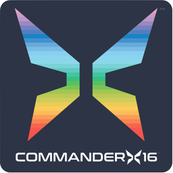

  

This is an emulator for the Commander X16 computer system. It only depends on SDL2 and should compile on all modern operating systems.

Binaries & Compiling
--------------------

Binary releases for macOS, Windows and x86_64 Linux are available on the [releases page][releases].

The emulator itself is dependent only on SDL2. However, to run the emulated system you will also need a compatible `rom.bin` ROM image. This will be
loaded from the directory containing the emulator binary, or you can use the `-rom .../path/to/rom.bin` option.

> __WARNING:__ Older versions of the ROM might not work in newer versions of the emulator, and vice versa.

You can build a ROM image yourself using the [build instructions][x16rom-build] in the [x16-rom] repo. The `rom.bin` included in the [_latest_ release][releases] of the emulator may also work with the HEAD of this repo, but this is not guaranteed.

### macOS Build

Install SDL2 using `brew install sdl2`.

### Linux Build

The SDL2 development package is available as a distribution package with most major versions of Linux:
- Red Hat: `yum install SDL2-devel`
- Debian: `apt-get install libsdl2-dev`

Type `make` to build the source. The output will be `x16emu` in the current directory. Remember you will also need a `rom.bin` as described above.

### WebAssembly Build

Steps for compiling WebAssembly/HTML5 can be found [here][webassembly].

Starting
--------

You can start `x16emu`/`x16emu.exe` either by double-clicking it, or from the command line. The latter allows you to specify additional arguments.

* When starting `x16emu` without arguments, it will pick up the system ROM (`rom.bin`) from the executable's directory.
* The system ROM filename/path can be overridden with the `-rom` command line argument.
* `-keymap` tells the KERNAL to switch to a specific keyboard layout. Use it without an argument to view the supported layouts.
* `-sdcard` lets you specify an SD card image (partition table + FAT32).
* `-prg` lets you specify a `.prg` file that gets injected into RAM after start.
* `-bas` lets you specify a BASIC program in ASCII format that automatically typed in (and tokenized).
* `-run` executes the application specified through `-prg` or `-bas` using `RUN` or `SYS`, depending on the load address.
* `-geos` launches GEOS at startup.
* `-scale` scales video output to an integer multiple of 640x480
* `-echo` causes all KERNAL/BASIC output to be printed to the host's terminal. Enable this and use the BASIC command "LIST" to convert a BASIC program to ASCII (detokenize).
* `-warp` causes the emulator to run as fast as possible, possibly faster than a real X16.
* `-gif <filename>[,wait]` to record the screen into a GIF. See below for more info.
* `-quality` change image scaling algorithm quality
	* `nearest`: nearest pixel sampling
	* `linear`: linear filtering
	* `best`: (default) anisotropic filtering
* `-log` enables one or more types of logging (e.g. `-log KS`):
	* `K`: keyboard (key-up and key-down events)
	* `S`: speed (CPU load, frame misses)
	* `V`: video I/O reads and writes
* `-debug` enables the debugger.
* `-dump` configure system dump (e.g. `-dump CB`):
	* `C`: CPU registers (7 B: A,X,Y,SP,STATUS,PC)
	* `R`: RAM (40 KiB)
	* `B`: Banked RAM (2 MiB)
	* `V`: Video RAM and registers (128 KiB VRAM, 32 B composer registers, 512 B pallete, 16 B layer0 registers, 16 B layer1 registers, 16 B sprite registers, 2 KiB sprite attributes)
* `-sound` can be used to specify the output sound device.
* `-abufs` can be used to specify the number of audio buffers (defaults to 8). If you're experiencing stuttering in the audio try to increase this number. This will result in additional audio latency though.
* When compiled with `#define TRACE`, `-trace` will enable an instruction trace on stdout.

Run `x16emu -h` to see all command line options.

Keyboard Layout
---------------

The X16 uses a PS/2 keyboard, and the ROM currently supports several different layouts. The following table shows their names, and what keys produce different characters than expected:

|Name  |Description 	       |Differences|
|------|------------------------|-------|
|en-us |US		       |[`] ⇒ [←], [~] ⇒ [π], [&#92;] ⇒ [£]|
|en-gb |United Kingdom	       |[`] ⇒ [←], [~] ⇒ [π]|
|de    |German		       |[§] ⇒ [£], [´] ⇒ [^], [^] ⇒ [←], [°] ⇒ [π]|
|nordic|Nordic                 |key left of [1] ⇒ [←],[π]|
|it    |Italian		       |[&#92;] ⇒ [←], [&vert;] ⇒ [π]|
|pl    |Polish (Programmers)   |[`] ⇒ [←], [~] ⇒ [π], [&#92;] ⇒ [£]|
|hu    |Hungarian	       |[&#92;] ⇒ [←], [&vert;] ⇒ [π], [§] ⇒ [£]|
|es    |Spanish		       |[&vert;] ⇒ π, &#92; ⇒ [←], Alt + [<] ⇒ [£]|
|fr    |French		       |[²] ⇒ [←], [§] ⇒ [£]|
|de-ch |Swiss German	       |[^] ⇒ [←], [°] ⇒ [π]|
|fr-be |Belgian French	       |[²] ⇒ [←], [³] ⇒ [π]|
|fi    |Finnish		       |[§] ⇒ [←], [½] ⇒ [π]|
|pt-br |Portuguese (Brazil ABNT)|[&#92;] ⇒ [←], [&vert;] ⇒ [π]|

Keys that produce international characters (like [ä] or [ç]) will not produce any character.

Since the emulator tells the computer the *position* of keys that are pressed, you need to configure the layout for the computer independently of the keyboard layout you have configured on the host.

**Use the F9 key to cycle through the layouts, or set the keyboard layout at startup using the `-keymap` command line argument.**

The following keys can be used for controlling games:

|Keyboard Key  | NES Equivalent |
|--------------|----------------|
|Ctrl          | A 		|
|Alt 	       | B		|
|Space         | SELECT         |
|Enter         | START		|
|Cursor Up     | UP		|
|Cursor Down   | DOWN		|
|Cursor Left   | LEFT		|
|Cursor Right  | RIGHT		|

Functions while running
-----------------------

* `Ctrl` + `R` will reset the computer.
* `Ctrl` + `V` will paste the clipboard by injecting key presses.
* `Ctrl` + `S` will save a system dump (configurable with `-dump`) to disk.
* `Ctrl` + `F` and `Ctrl` + `Return` will toggle full screen mode.
* `Ctrl` + `=` and `Ctrl` + `+` will toggle warp mode.

On the Mac, use the `Cmd` key instead.

GIF Recording
-------------

With the argument `-gif`, followed by a filename, a screen recording will be saved into the given GIF file. Please exit the emulator before reading the GIF file.

If the option `,wait` is specified after the filename, it will start recording on `POKE $9FB5,2`. It will capture a single frame on `POKE $9FB5,1` and pause recording on `POKE $9FB5,0`. `PEEK($9FB5)` returns a 128 if recording is enabled but not active.

BASIC and the Screen Editor
---------------------------

On startup, the X16 presents direct mode of BASIC V2. You can enter BASIC statements, or line numbers with BASIC statements and `RUN` the program, just like on Commodore computers.

* To stop execution of a BASIC program, hit the `RUN/STOP` key (`Esc` in the emulator), or `Ctrl + C`.
* To insert characters, first insert spaces by pressing `Shift + Backspaces`, then type over those spaces.
* To clear the screen, press `Shift + Home`.
* The X16 does not have a `STOP + RESTORE` function.

Host Filesystem Interface
-------------------------

If the system ROM contains any version of the KERNAL, the LOAD (`$FFD5`) and SAVE (`$FFD8`) KERNAL calls are intercepted by the emulator if the device is 1 (which is the default). So the BASIC statements

      LOAD"$
      LOAD"FOO.PRG
      LOAD"IMAGE.PRG",1,1
      SAVE"BAR.PRG

will target the host computer's local filesystem.

The emulator will interpret filenames relative to the directory it was started in. Note that on macOS, when double-clicking the executable, this is the home directory.

To avoid incompatibility problems between the PETSCII and ASCII encodings, use lower case filenames on the host side, and unshifted filenames on the X16 side.

Dealing with BASIC Programs
---------------------------

BASIC programs are encoded in a tokenized form, they are not simply ASCII files. If you want to edit BASIC programs on the host's text editor, you need to convert it between tokenized BASIC form and ASCII.

* To convert ASCII to BASIC, reboot the machine and paste the ASCII text using `Ctrl + V` (Mac: `Cmd + V`). You can now run the program, or use the `SAVE` BASIC command to write the tokenized version to disk.
* To convert BASIC to ASCII, start x16emu with the `-echo` argument, `LOAD` the BASIC file, and type `LIST`. Now copy the ASCII version from the terminal.

Using the KERNAL/BASIC environment
----------------------------------

Please see the KERNAL/BASIC documentation.

Debugger
--------

The debugger requires `-debug` to start. Without it it is effectively disabled.

There are 2 panels you can control. The code panel, the top left half, and the data panel, the bottom half of the screen. You can also edit the contents of the registers PC, A, X, Y, and SP.

The debugger uses its own command line with the following syntax:

|Statement|Description|
|---------|----------------------------------------------------------------------------------------------------|
|d %x|Change the code panel to view disassembly starting from the address %x.|
|m %x|Change the data panel to view memory starting from the address %x.|
|b %s %d|Changes the current memory bank for disassembly and data. The %s param can be either 'ram' or 'rom', the %d is the memory bank to display.|
|r %s %x|Changes the value in the specified register. Valid registers in the %s param are 'pc', 'a', 'x', 'y', and 'sp'. %x is the value to store in that register.|

The debugger keys are similar to the Microsoft Debugger shortcut keys, and work as follows

|Key|Description 																			|
|---|---------------------------------------------------------------------------------------|
|F1 |resets the shown code position to the current PC										|
|F2 |resets the 65C02 CPU but not any of the hardware.										|
|F5 |is used to return to Run mode, the emulator should run as normal.						|
|F9 |sets the breakpoint to the currently code position.									|
|F10|steps 'over' routines - if the next instruction is JSR it will break on return.		|
|F11|steps 'into' routines.																	|
|F12|is used to break back into the debugger. This does not happen if you do not have -debug|
|TAB|when stopped, or single stepping, hides the debug information when pressed 			|

When `-debug` is selected the No-Operation $FF will break into the debugger automatically.

Effectively keyboard routines only work when the debugger is running normally. Single stepping through keyboard code will not work at present.

Wiki
----

https://github.com/commanderx16/x16-emulator/wiki

Features
--------

* CPU: Full 65C02 instruction set (improved "fake6502")
* VERA
	* Mostly cycle exact emulation
	* Supports almost all features:
		* composer
		* two layers
		* sprites
		* progressive/interlaced
		* VSYNC and raster IRQ
* VIA
	* ROM/RAM banking
	* keyboard
	* mouse
	* gamepad
	* SD card (SPI)
* Sound
    * PCM
    * PSG
    * YM2151

Missing Features
----------------

* VERA
	* Does not support the "CURRENT_FIELD" bit
	* Does not support sprite collisions
	*	Interlaced modes (NTSC/RGB) don't render at the full horizontal fidelity
* VIA
	* Does not support counters/timers/IRQs
* Sound
	* No SAA support

License
-------

Copyright (c) 2019 Michael Steil &lt;mist64@mac.com&gt;, [www.pagetable.com](https://www.pagetable.com/).
All rights reserved. License: 2-clause BSD

Known Issues
------------

* Emulator: `LOAD"$` (and `LOAD"$",1`) will show host uppercase filenames as garbage. Use `Ctrl+N` to switch to the X16 upper/lower character set for a workaround.

Release Notes
-------------

### Release 37 ("Geneva")

* VERA 0.9 register layout [Frank van den Hoef]
* audio [Frank van den Hoef]
    * VERA PCM and PSG audio support
    * YM2151 support is now enabled by default
    * added `-abufs` to specify number of audio buffers
* removed UART [Frank van den Hoef]
* added window icon [Nigel Stewart]
* fixed access to paths with non-ASCII characters on Windows [Serentty]
* SDL HiDPI hint to fix mouse scaling [Edward Kmett]

### Release 36 ("Berlin")

* added VERA UART emulation (`-uart-in`, `-uart-out`)
* correctly emulate missing SD card
* moved host filesystem interface from device 1 to device 8, only available if no SD card is attached
* require numeric argument for `-test` to auto-run test
* fixed JMP (a,x) for 65c02
* Fixed ESC as RUN/STOP [Ingo Hinterding]

### Release 35

* video optimization [Neil Forbes-Richardson]
* added `-geos` to launch GEOS on startup
* added `-test` to launch (graphics) unit test on startup
* debugger
	* switch viewed RAM/ROM bank with `numpad +` and `numpad -` [Kobrasadetin]
	* optimized character printing [Kobrasadetin]
* trace mode:
	* prepend ROM bank to address in trace
	* also prints 16 bit virtual regs (graph/GEOS)
* fixes
	* initialize memory to 0 [Kobrasadetin]
	* fixed SYS hex argument
	* disabled "buffer full, skipping" and SD card debug text, it was too noisy

### Release 34

* PS/2 mouse
* support for text mode with tiles other than 8x8 [Serentty]
* fix: programmatic echo mode control [Mikael O. Bonnier]

### Release 33

* significant performance optimizations
* VERA
	* enabled all 128 sprites
	* correct sprite zdepth
	* support for raster IRQs
* SDL controller support using `-joy1` and `-joy2` [John J Bliss]
* 65C02 BCD fixes [Norman B. Lancaster]
* feature parity with new LOAD/VLOAD features [John-Paul Gignac]
* default RAM and ROM banks are now 0, matching the hardware
* GIF recording can now be controlled from inside the machine [Randall Bohn]
* Debugging
	* Major enhancements to the debugger [kktos]
	* `-echo` will now encode non-printable characters like this: \X93 for CHR$(93), `-bas` as 	well as pasting accepts this convention again
	* `-echo raw` for the original behavior
	* `-echo iso` for correct character encoding in ISO mode
	* `-ram` to specify RAM size; now defaults to 512

### Release 32

* correct ROM banking
* VERA emulation optimizations [Stephen Horn]
* added `-dump` option to allow writing RAM, CPU state or VERA state to disk [Nils Hasenbanck]
* added `-quality` option to change scaling algorithm; now defaults to "best" [Maurizio Porrato]
* output of `-echo` can now be fed into UNIX pipes [Anonymous Maarten]
* relative speed of emulator is shown in the title if host can't keep up [Rien]
* fix: 6502 BCD arithmetic [Rien]
* fix: colors (white is now white) [Rien]
* fix: sprite flipping [jjbliss]

### Release 31

* VERA 0.8 register layout
* removed `-char` (character ROM is now part of `rom.bin`)
* GIF recording using `-gif` [Neil Forbes-Richardson]
* numpad support [Maurizio Porrato]
* fake support of VIA timers to work around BASIC RND(0)
* default ROM is taken from executable's directory [Michael Watters]
* emulator window has a title [Michael Watters]
* `-debug` allows specifying a breakpoint [Frank Buss]
* package contains the ROM symbols in `rom.txt`
* support for VERA SPI

### Release 30

Emulator:
* VERA can now generate VSYNC interrupts
* added `-keymap` for setting the keyboard layout
* added `-scale` for integer scaling of the window [Stephen Horn]
* added `-log` to enable various logging features (can also be enabled at runtime (POKE $9FB0+) [Randall Bohn])
* changed `-run` to be an option to `-prg` and `-bas`
* emulator detection: read $9FBE/$9FBF, must read 0x31 and 0x36
* fix: `-prg` and `-run` no longer corrupt BASIC programs.
* fix: `LOAD,1` into RAM bank [Stephen Horn]
* fix: 2bpp and 4bpp drawing [Stephen Horn]
* fix: 4bpp sprites [MonstersGoBoom]
* fix: build on Linux/ARM

### Release 29

* better keyboard support: if you pretend you have a US keyboard layout when typing, all keys should now be reachable [Paul Robson]
* `-debug` will enable the new debugger [Paul Robson]
* runs at the correct speed (was way too slow on most machines)
* keyboard shortcuts work on Windows/Linux: `Ctrl + F/R/S/V`
* `Ctrl + V` pastes the clipboard as keypresses
* `-bas file.txt` loads a BASIC program in ASCII encoding
* `-echo` prints all BASIC/KERNAL output to the terminal, use it with LIST to convert a BASIC program to ASCII
* `-run` acts like `-prg`, but also autostarts the program
* `JMP $FFFF` and `SYS 65535` exit the emulator and save memory into the host's storage
* the packages now contain the current version of the Programmer's Reference Guide (HTML)
* fix: on Windows, some file load/saves may be been truncated

### Release 28

* support for 65C02 opcodes [Paul Robson]
* keep aspect ratio when resizing window [Sebastian Voges]
* updated sprite logic to VERA 0.7 – **the layout of the sprite data registers has changed, you need to change your code!**

### Release 27

* Command line overhaul. Supports `-rom`, `-char`, `-sdcard` and `-prg`.
* ROM and char filename defaults, so x16emu can be started without arguments.
* Host Filesystem Interface supports `LOAD"$"`
* macOS and Windows packaging logic in Makefile

### Release 26

* better sprite support (clipping, palette offset, flipping)
* better border support
* KERNAL can set up interlaced NTSC mode with scaling and borders (compile time option)

### Release 25

* sdcard: fixed `LOAD,x,1` to load to the correct addressg
* sdcard: all temp data will be on bank #255; current bank will remain unchanged
* DOS: support for DOS commands ("UI", "I", "V", ...) and more status messages (e.g. 26,WRITE PROTECT ON,00,00)
* BASIC: `DOS` command. Without argument: print disk status; with "$" argument: show directory; with "8" or "9" argument: switch default drive; otherwise: send DOS command; also accessible through F7/F8
* Vera: cycle exact rendering, NTSC, interlacing, border

### Release 24

* SD card support
	* pass path to SD card image as third argument
	* access SD card as drive 8
	* the local PC/Mac disk is still drive 1
	* modulo debugging, this would work on a real X16 with the SD card (plus level shifters) hooked up to VIA#2PB as described in sdcard.c in the emulator surce

### Release 23

* Updated emulator and ROM to spec 0.6 – the ROM image should work on a real X16 with VERA 0.6 now.

### Release 22

SYS65375 (SWAPPER) now also clears the screen, avoid ing side effects.

### Release 21

* support for $ and % number prefixes in BASIC
* support for C128 KERNAL APIs LKUPLA, LKUPSA and CLOSE_ALL

### Release 20

* Toggle fullscreen using `Cmd + F` or `Cmd + return`
* new BASIC instructions and functions:
	* `MON`: enter monitor; no more SYS65280 required
	* `VPEEK(bank, address)`
	* `VPOKE bank, address, value`
example: `VPOKE4,0,VPEEK(4,0) OR 32` [for 256 color BASIC]

### Release 19

* fixed cursor trail bug
* fixed f7 key in PS/2 driver
* f keys are assigned with shortcuts now:
F1: LIST
F2: &lt;enter monitor&gt;
F3: RUN
F4: &lt;switch 40/80&gt;
F5: LOAD
F6: SAVE"
F7: DOS"$ &lt;doesn't work yet&gt;
F8: DOS &lt;doesn't work yet&gt;

### Release 18

* Fixed scrolling in 40x30 mode when there are double lines on the screen.

### Release 17

* video RAM support in the monitor (SYS65280)
* 40x30 screen support (SYS65375 to toggle)

### Release 16

* Integrated monitor, start with SYS65280
`rom.bin` is now 3*8 KB:
	* 0: BASIC (bank 0 at $C000)
	* 1: KERNAL ($E000)
	* 2: UTIL (bank 1 at $C000)

### Release 15

* correct text mode video RAM layout both in emulator and KERNAL

### Release 14

* KERNAL: fast scrolling
* KERNAL: upper/lower switching using CHR$($0E)/CHR$($8E)
* KERNAL: banking init
* KERNAL: new PS/2 driver
* Emulator: VERA updates (more modes, second data port)
* Emulator: RAM and ROM banks start out as all 1 bits

### Release 13

* Supports mode 7 (8bpp bitmap).

### Release 12

* Supports 8bpp tile mode (mode 4)

### Release 11

* The emulator and the KERNAL now speak the bit-level PS/2 protocol over VIA#2 PA0/PA1. The system behaves the same, but keyboard input in the ROM should work on a real device.

### Release 10

updated KERNAL with proper power-on message

### Release 9

* LOAD and SAVE commands are intercepted by the emulator, can be used to access local file system, like this:

      LOAD"TETRIS.PRG
      SAVE"TETRIS.PRG

* No device number is necessary. Loading absolute works like this:

      LOAD"FILE.PRG",1,1

### Release 8

* New optional override load address for PRG files:

      ./x64emu rom.bin chargen.bin basic.prg,0401

### Release 7

* Now with banking. `POKE40801,n` to switch the RAM bank at $A000. `POKE40800,n` to switch the ROM bank at $C000. The ROM file at the command line can be up to 72 KB now (layout: 0: bank 0, 1: KERNAL, 2: bank 1, 3: bank 2 etc.), and the RAM that `Cmd + S` saves is 2088KB ($0000-$9F00: regular RAM, $9F00-$9FFF: unused, $A000+: extra banks)

### Release 6

* Vera emulation now matches the complete spec dated 2019-07-06: correct video address space layout, palette format, redefinable character set

### Release 5

* BASIC now starts at $0401 (39679 BASIC BYTES FREE)

### Release 4

* `Cmd + S` now saves all of memory (linear 64 KB for now, including ROM) to `memory.bin`, `memory-1.bin`, `memory-2.bin`, etc. You can extract parts of it with Unix "dd", like: `dd if=memory.bin of=basic.bin bs=1 skip=2049 count=38655`

### Release 3

* Supports PRG file as third argument, which is injected after "READY.", so BASIC programs work as well.

### Release 2

* STOP key support

### Release 1

* 6502 core, fake PS/2 keyboard emulation (PS/2 data bytes appear at VIA#1 PB) and text mode Vera emulation
* KERNAL/BASIC modified for memory layout, missing VIC, Vera text mode and PS/2 keyboard

<!-------------------------------------------------------------------->
[releases]: https://github.com/commanderx16/x16-emulator/releases
[webassembly]: webassembly/WebAssembly.md
[x16rom-build]: https://github.com/commanderx16/x16-rom#releases-and-building
[x16rom]: https://github.com/commanderx16/x16-rom
